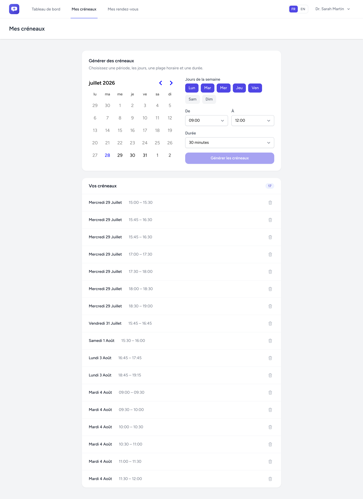
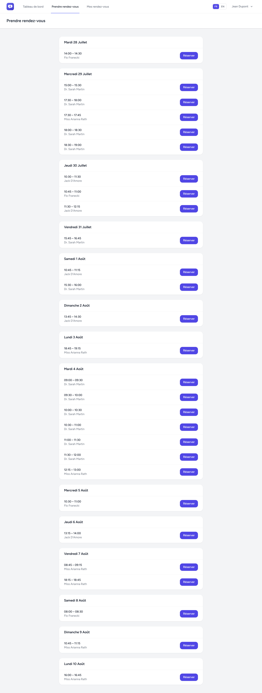
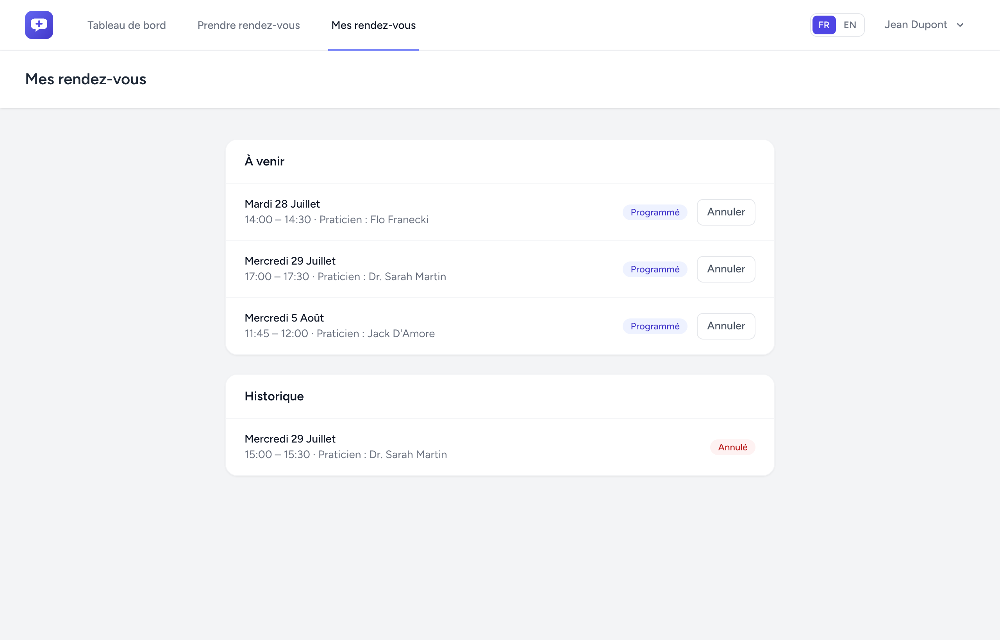
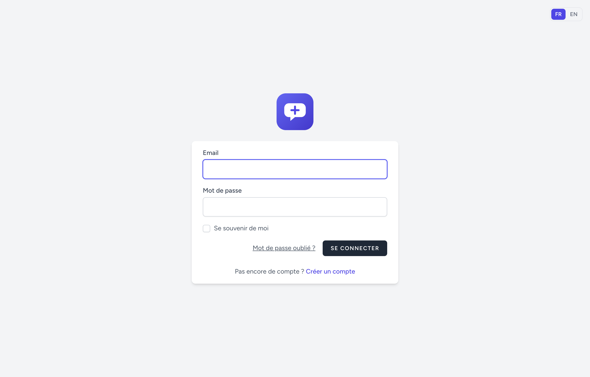

<p align="center">
  
</p>

<h1 align="center">Consulteoo</h1>

<p align="center">
  Application de <strong>prise de rendez-vous & téléconsultation</strong> —
  les praticiens publient leurs créneaux, les patients réservent en ligne.
</p>

<p align="center">
  
</p>

---

## ✨ Aperçu

Consulteoo est un projet full-stack qui gère un vrai cas métier de A à Z : gestion des
disponibilités côté praticien, réservation côté patient, annulation, et un back-office
authentifié — le tout **testé** et **conteneurisé**.

> **Projet personnel de démonstration** (portfolio).

## 📸 Captures d'écran

| Génération de créneaux — praticien | Réservation — patient |
|:---:|:---:|
|  |  |
| **Mes rendez-vous — patient** | **Connexion (FR/EN)** |
|  |  |

## 🚀 Fonctionnalités

- 👥 **Deux rôles** : praticien / patient (accès protégés par middleware)
- 🗓️ **Génération de créneaux en lot** (période + jours + plage horaire + durée)
- 🛡️ **Anti-chevauchement** des créneaux (test d'intervalles)
- 📅 **Réservation** patient avec **protection anti-double-booking** (transaction + verrou)
- ❌ **Annulation** d'un rendez-vous (qui relibère automatiquement le créneau)
- 🌍 **Internationalisation** FR / EN (français par défaut), dates & calendrier localisés
- 🔐 **Authentification** complète (Laravel Breeze)

## 🧱 Stack technique

| Domaine | Technologies |
|---|---|
| Back-end | **Laravel 13**, PHP 8.5 |
| Front-end | **Inertia.js**, **React 18**, **TypeScript**, Tailwind CSS |
| Base de données | MySQL |
| Environnement | **Docker** (Laravel Sail) |
| Tests | **PHPUnit** |
| Qualité / CI | Laravel Pint, **GitHub Actions** |

## ⚡ Démarrage rapide (Docker)

Prérequis : **Docker Desktop**.

```bash
# 1. Cloner
git clone https://github.com/retr0mon/consulteoo.git
cd consulteoo

# 2. Installer les dépendances PHP (via un conteneur, sans PHP local)
docker run --rm -v "$(pwd):/opt" -w /opt laravelsail/php85-composer:latest \
    composer install --ignore-platform-reqs

# 3. Environnement
cp .env.example .env

# 4. Lancer les conteneurs (Sail)
./vendor/bin/sail up -d
./vendor/bin/sail artisan key:generate
./vendor/bin/sail artisan migrate --seed

# 5. Front-end
./vendor/bin/sail npm install
./vendor/bin/sail npm run dev
```

L'application est alors disponible sur **http://localhost** (le port est configurable via `APP_PORT`).

### 🔑 Comptes de démonstration

Le seeder crée deux comptes (mot de passe : `password`) :

| Rôle | Email |
|---|---|
| Praticien | `praticien@consulteoo.test` |
| Patient | `patient@consulteoo.test` |

## ✅ Tests

```bash
./vendor/bin/sail artisan test
```

La suite couvre les règles métier critiques : autorisations praticien/patient,
chevauchement de créneaux, anti-double-booking, et annulation qui relibère le créneau.

## 💡 Choix techniques mis en avant

- **Anti-double-booking** : la réservation s'exécute dans une **transaction** avec
  `lockForUpdate()` sur le créneau → deux patients ne peuvent pas réserver le même créneau
  simultanément (gestion de la *race condition*).
- **Créneau vs rendez-vous** : deux concepts séparés → un créneau annulé conserve son
  historique et redevient réservable (disponibilité **déduite**, non dénormalisée).
- **Internationalisation** : textes via un dictionnaire (`lang/*.json`) partagé par Inertia +
  formatage des dates/calendrier selon la langue (API `Intl` / `date-fns`).
- **CI** : à chaque push, GitHub Actions vérifie le style (Pint) et lance les tests sur un
  MySQL de service.

---

<p align="center"><sub>Construit avec Laravel, Inertia & React.</sub></p>
